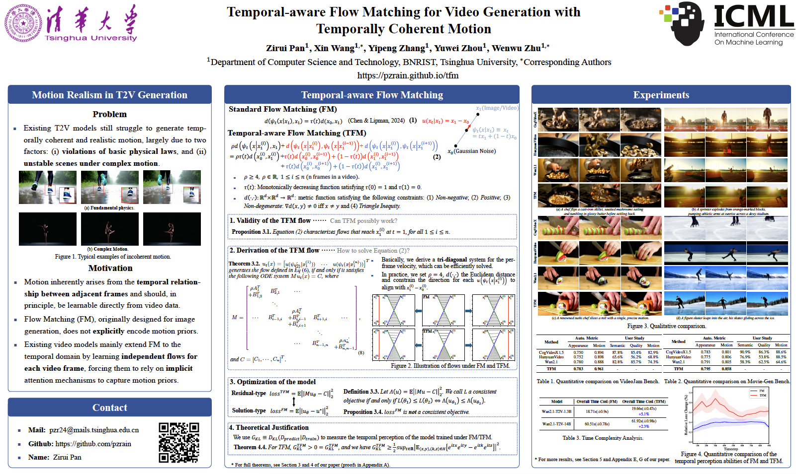
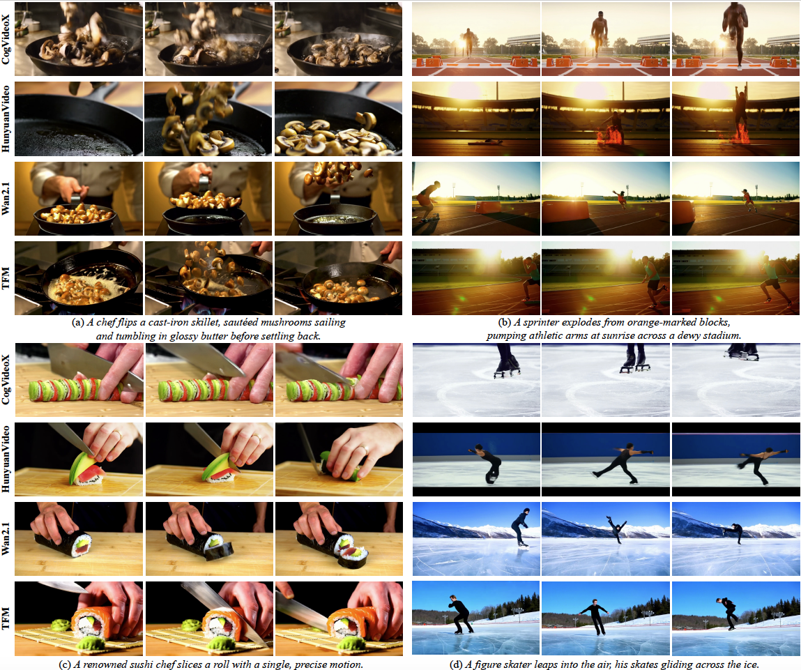
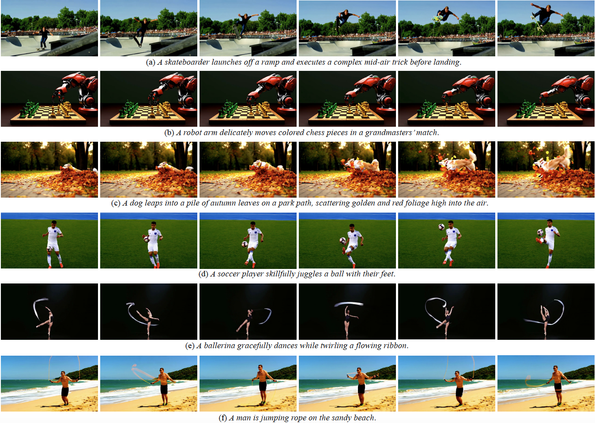

# Temporal-aware Flow Matching for Video Generation with Temporally Coherent Motion
> [Temporal-aware Flow Matching for Video Generation with Temporally Coherent Motion](https://mn.cs.tsinghua.edu.cn/xinwang/PDF/papers/2026_Temporal-aware%20Flow%20Matching%20for%20Video%20Generation%20with%20Temporally%20Coherent%20Motion.pdf)
> 
> Zirui Pan, Xin Wang, Yipeng Zhang, Yuwei Zhou, Wenwu Zhu
>
> Department of Computer Science and Technology, BNRist, Tsinghua University, Beijing, China

## Overview
This is the official implementation of ICML 2026 paper [*Temporal-aware Flow Matching for Video Generation with Temporally Coherent Motion*](https://mn.cs.tsinghua.edu.cn/xinwang/PDF/papers/2026_Temporal-aware%20Flow%20Matching%20for%20Video%20Generation%20with%20Temporally%20Coherent%20Motion.pdf). The fine-tuned lora weights for base Wan2.1-T2V-14B model can be downloaded from [Goolge Drive](https://drive.google.com/file/d/1nyvi83HOcooH9K_vD7TcY2bxM4BLFRXV/view?usp=sharing). For animated video results, please refer to our [Project Page](https://pzrain.github.io/tfm).

## Method
TL;DR: We propose Temporal-aware Flow Matching (TFM), which explicitly incorporates inter-frame constraints into the flow objective to facilitate the learning of motion dynamics in video generative models.

Despite rapid advances in text-to-video generation, state-of-the-art generative models still suffer from producing temporally incoherent and unrealistic motion for videos. The key weakness of existing works is that they commonly treat videos as frame sequences and directly adopt Flow Matching (FM) objectives, which are originally designed for images. This practice fails to explicitly model motion priors or temporal dependencies, resulting in suboptimal dynamics that may appear incoherent and unrealistic. To solve this problem, we propose Temporal-aware Flow Matching (TFM), a novel training paradigm that embeds inter-frame constraints into the flow objective, leading to temporally coherent motion modeling in video generation. More specifically, the proposed TFM enforces temporal correlations across frames while retaining the desirable properties of FM, and further introduces a residual-type loss that aligns naturally with this new flow. We theoretically prove that models trained with TFM are able to exhibit remarkably enhanced temporal perception ability. Notably, TFM imposes no additional cost during inference and is applicable to any model using FM. Extensive experiments demonstrate that our TFM can significantly improve motion realism across diverse motion types.


## Generated Results
### Qualitative comparison


### Generates samples


## Installation
```bash
git clone https://github.com/pzrain/TFM.git
cd TFM
conda create -n tfm python=3.10
pip install -e .
```
Please download the pre-trained weights of [Wan2.1-T2V-14B](https://huggingface.co/Wan-AI/Wan2.1-T2V-14B) into `models/Wan-AI/Wan2.1-T2V-14B`, and download our fine-tuned [lora weights](https://drive.google.com/file/d/1nyvi83HOcooH9K_vD7TcY2bxM4BLFRXV/view?usp=sharing) into `models/Wan-AI/tfm-lora.safetensors`.

## Training
We use the public [ShareGPT4Video](https://huggingface.co/datasets/ShareGPT4Video/ShareGPT4Video) dataset for training, which contains approximately 40K video-text pairs. For fine-tuning Wan2.1-T2V-14B with TFM, you need to download the dataset, generate a `metadata.csv` accordingly, and input its path into `--dataset_metadata_path` in `examples/wanvideo/model_training/Wan2.1-T2V-14B.sh`. We give an example of the metadata file in `examples/wanvideo/model_training/metadata_example.csv`.

Run the following command:
```bash
bash examples/wanvideo/model_training/Wan2.1-T2V-14B.sh
```
To reproduce our results, we recommend training with 4×A100 80GB GPUs. In our experience, the full training process takes approximately one week. Our codebase is built upon [DiffSynth-Studio](https://github.com/modelscope/diffsynth-studio). If you would like to develop new methods based on our framework, the core implementation can be found in `diffsynth.pipelines.wan_video_new.WanVideoPipeline.training_loss` and `diffsynth/schedulers/flow_match.py`.

## Inference
For inference, run the following command:
```bash
CUDA_VISIBLE_DEVICES=0 python examples/wanvideo/model_inference/Wan2.1-T2V-14B.py
```
To reproduce our results, we recommend running inference on a single A100 40GB GPU. The inference script first loads the base Wan2.1-T2V-14B model, then applies our fine-tuned LoRA weights, and finally reads prompts from `examples/wanvideo/model_inference/prompts.txt`. The generated results will be saved in the `results` directory. To use your own prompts, simply add them to `prompts.txt`.

## Acknowledgements
This codebase is built upon [Diffsynth-Studio](https://github.com/modelscope/diffsynth-studio). The method is built upon [Wan2.1](https://github.com/Wan-Video/Wan2.1).

## Citation
If you find our work useful, please kindly cite our work:
```bash
@inproceedings{pan2026temporal,
  title={Temporal-aware Flow Matching for Video Generation with Temporally Coherent Motion},
  author={Pan, Zirui and Wang, Xin and Zhang, Yipeng and Zhou, Yuwei and Zhu, Wenwu},
  booktitle={Forty-third International Conference on Machine Learning},
  year={2026}
}
```
